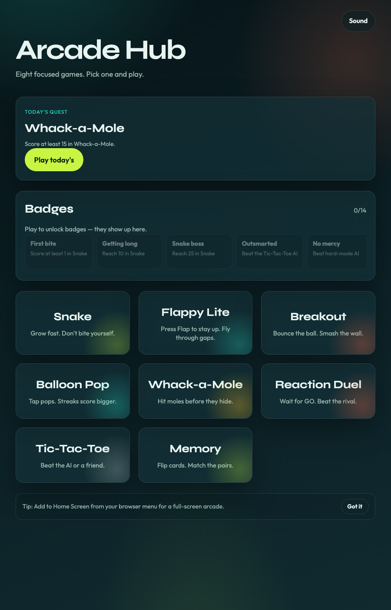
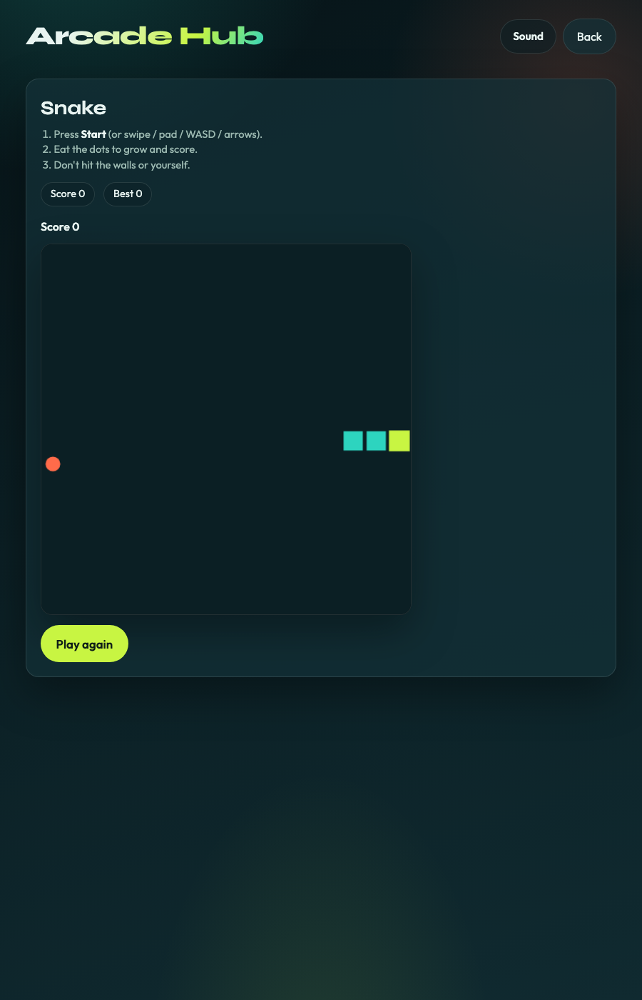
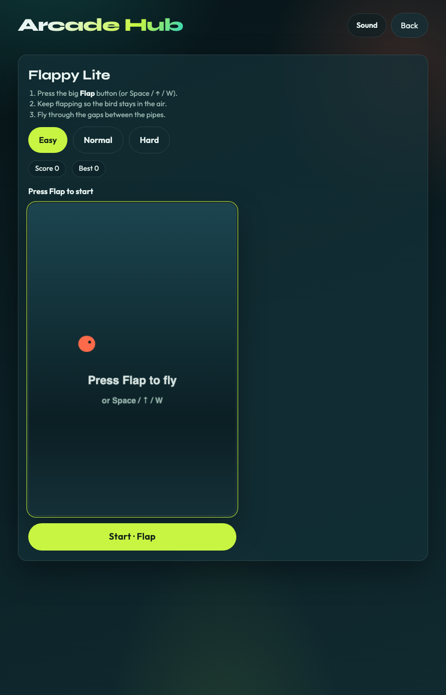
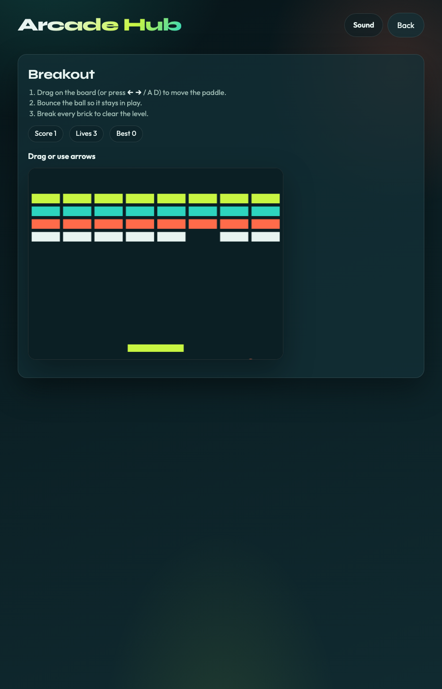
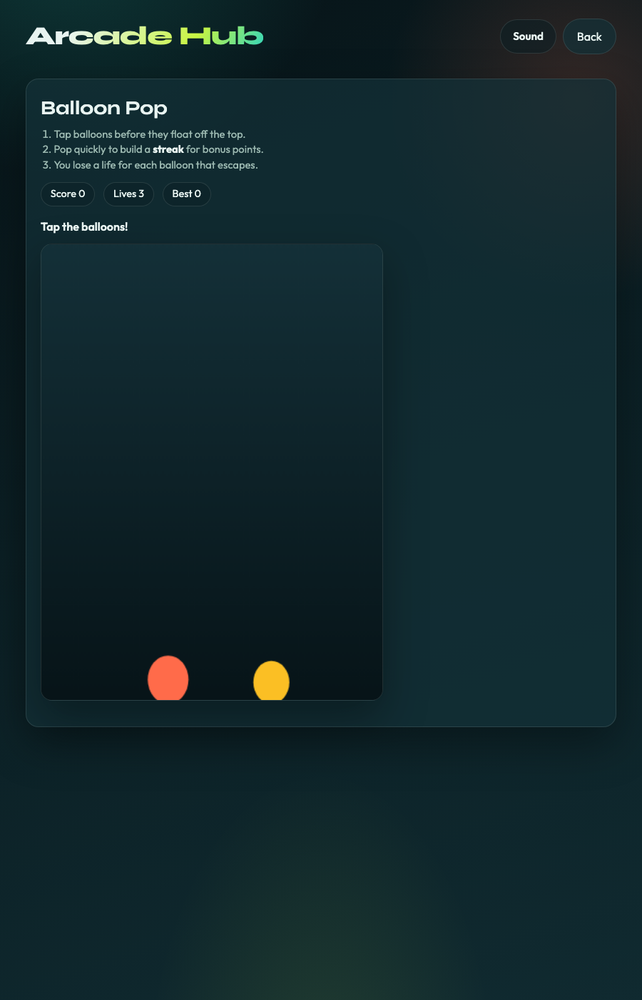
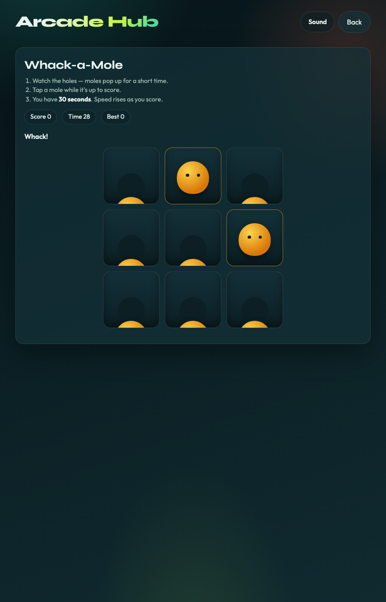
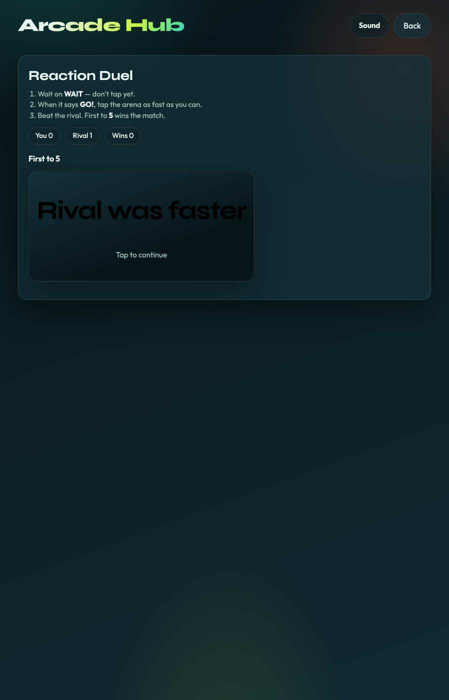
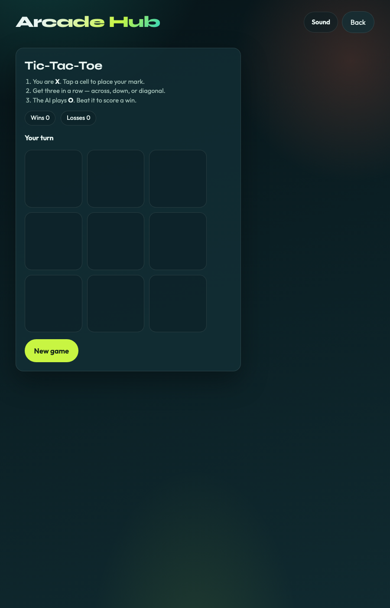
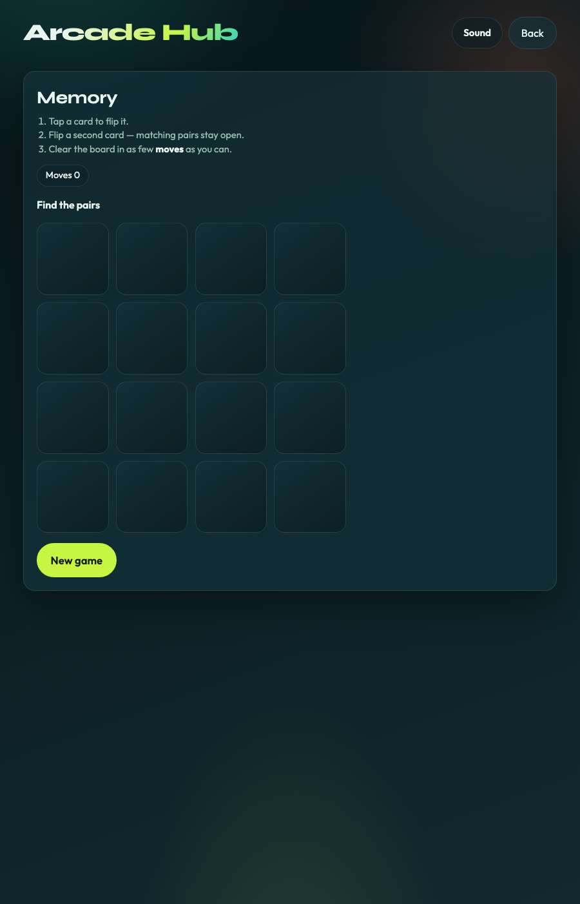

# Arcade Hub

A small TypeScript arcade you can actually play:

- **Snake** — canvas loop, pause, swipe / WASD, high score
- **Flappy Lite** — tap to flap, easy / normal / hard
- **Breakout** — paddle bounce, drag or arrow keys, clear the wall
- **Balloon Pop** — tap to pop, streak bonuses, forgiving mobile hits
- **Whack-a-Mole** — 30-second rounds, rising speed, streak hits
- **Reaction Duel** — wait for GO, beat the rival, first to 5
- **Tic-Tac-Toe** — minimax AI or vs friend
- **Memory Match** — flip pairs, best run

Shared mute, daily challenge, badge strip, best scores row, recent plays, soft PWA install tip, continue last game, offline cache, and scores in `localStorage`.

## Live demo

https://selengr.github.io/arcade-hub/

## Screenshots

### Hub



### Games

| Snake | Flappy Lite |
| --- | --- |
|  |  |

| Breakout | Balloon Pop |
| --- | --- |
|  |  |

| Whack-a-Mole | Reaction Duel |
| --- | --- |
|  |  |

| Tic-Tac-Toe | Memory |
| --- | --- |
|  |  |

## Run locally

```bash
npm install
npm run dev
```

## Test

```bash
npm test
```

## Build

```bash
npm run build
npm run preview
```

## Screenshots (regenerate)

With preview running on port 4173:

```bash
npm run build
npx vite preview --host 127.0.0.1 --port 4173
# then in another terminal:
node scripts/capture-screenshots.mjs
```

## Deploy

Push to `main`. GitHub Actions builds and publishes Pages.

Repo settings → Pages → Source → **GitHub Actions**.
